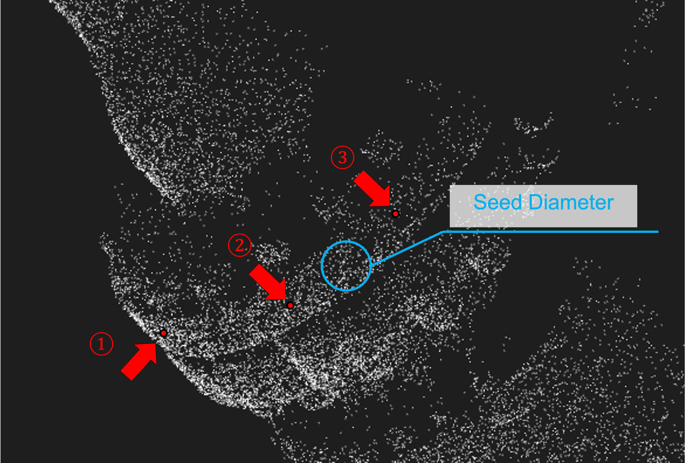

# FindSurface - Tips - C

**Curv*Surf* FindSurface™**

## How to Use the specializations of [`findSurface`](https://github.com/CurvSurf/FindSurface-Windows/blob/master/FindSurface-API-reference-C.md#findsurface)

The [specializations](https://github.com/CurvSurf/FindSurface-Windows/blob/master/FindSurface-API-reference-C.md#specializations-of-findsurface) of [`findSurface`](https://github.com/CurvSurf/FindSurface-Windows/blob/master/FindSurface-API-reference-C.md#findsurface) function are designed to support a feature of detecting surfaces of particular types. Those particular types are not easily found by invoking [`findSurface`](https://github.com/CurvSurf/FindSurface-Windows/blob/master/FindSurface-API-reference-C.md#findsurface), because they usually tend to be narrow or thin, leading to points insufficient for analyzing the local curvature. The specialization functions take two or three seed points, which should be distant from each other so that the algorithm can perform the local curvature analysis based on the region that the seeds form.

Here is the list of the particular types that the specializations can detect:

- Strip plane (long and narrow)
- Rod cylinder (long and narrow)
- Disk cylinder (thin and broad)
- Disk cone (thin and broad)
- Thin ring torus

For detecting these particular types, half of the target's thickness should be set to the seed radius (as shown in the picture below, the seed radius is half of the seed diameter, not the size of the target object. 

When using the specializations, the order of the arrangements of the seed indices matters. The algorithm of FindSurface may fail to detect a surface if the seeds are given to the function in a wrong order even though the other parameters was set to appropriate values.

As an example, let's take a look at the following situation:

In this point cloud, there are no scanned points in the back side. 

Suppose that the goal is to find the disk cylinder at the center. The three points (red) are picked for the seed points. 

The seed points should be passed in the order: 1 -> 2 -> 3 or 3 -> 2 -> 1. 

Not in the order: 1 -> 3 -> 2 or 2 -> 3 -> 1.

If you pass the indices of the seed points to the [`findSurface`](https://github.com/CurvSurf/FindSurface-Windows/blob/master/FindSurface-API-reference-C.md#findsurface) function in the order: 1 -> 3 -> 2, the algorithm will attempts to analyze the local curvature in the region including the back side, which has no points at all. The point is to avoid the round-trip to a void in the point cloud.

